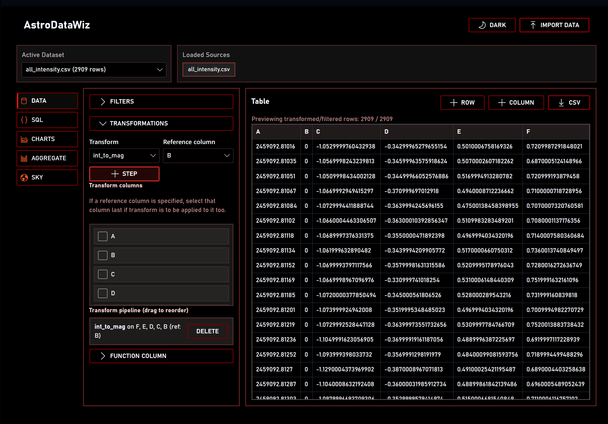
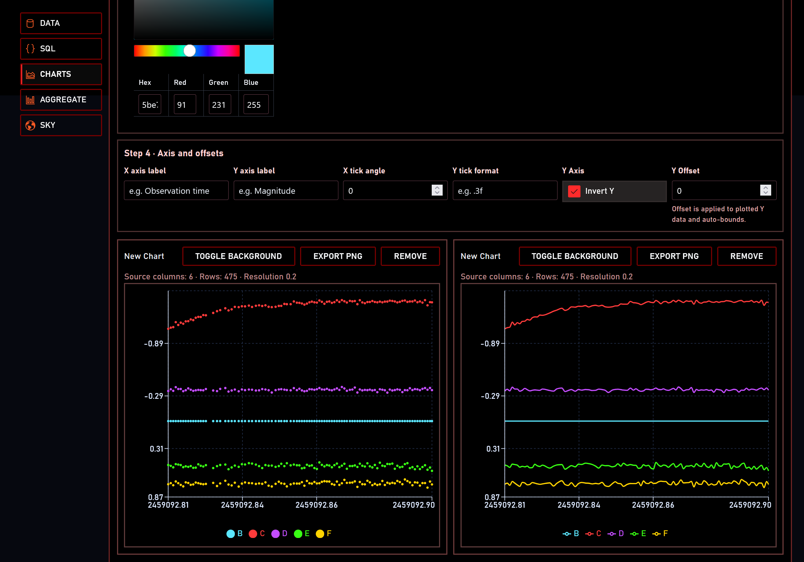
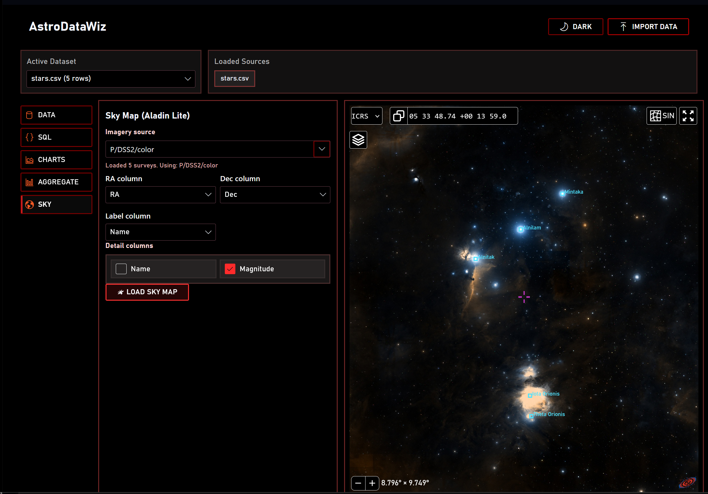

# AstroDataWiz
A web-based interactive data exploration and visualization tool for astronomers, built with React and TypeScript. It supports importing large tables, applying filters/transforms, running SQL queries, creating charts, and visualizing RA/Dec sky maps with Aladin Lite.

## Features

- Import large tables from `.csv`, `.xml`, `.vot`, `.b64`
- Table viewer with per-column filters
- Per-column transforms (`ln`, `sqrt`, `inv`, `magnitude to intensity`, `intensity to magnitude`, etc.)
- Excel-like function columns using expressions
- SQL query workbench (in-browser, via AlaSQL)
- Save SQL query outputs as reusable chart datasets
- Multi-chart dashboard (scatter, line, histogram, pie)
- Chart customization (title, axis labels, tick angle/format, color, legend)
- Export any chart as PNG, or export all charts as ZIP
- Export filtered/query tables as CSV
- RA/Dec sky plotting in Aladin Lite with labels/details

## How to Run

```bash
npm i
npm run dev
```

## How to Use

1. Import one or more source files.
2. Select an active dataset.
3. Apply filters/transforms and create formula columns.
4. Use SQL tab to query across loaded tables and save outputs as new datasets.
5. Create one or more charts in the Charts tab.
6. Use the Sky tab for RA/Dec visualization in Aladin Lite.
7. Export images/CSV outputs as needed.

## Screenshots

### Data



### Charts



### Sky View



# Todo
- Image viewer and manipulation for fits/png files
